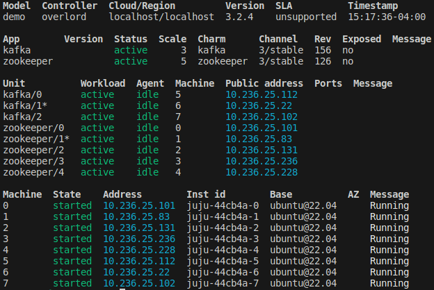
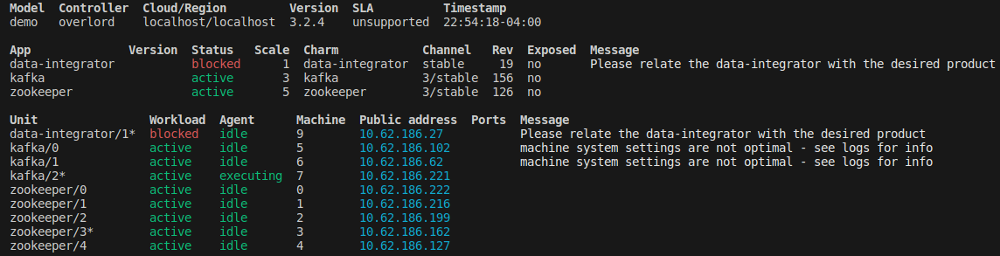

# Kafka on MicroStack

# Tutorials
* [install-microstack](https://microstack.run)
* [charmed-kafka](https://canonical.com/data/docs/kafka/iaas/t-overview)
* [zero-to-hero-kafka-connect](https://github.com/confluentinc/demo-scene/blob/master/kafka-connect-zero-to-hero/demo_zero-to-hero-with-kafka-connect.adoc)
* [debezium-kafka-connect](https://debezium.io/documentation/reference/stable/architecture.html)

## Bash Scripts
To run Kafka in single-broker mode, execute:
* ```. bash-scripts/run.sh```

## Remove microstack (clean environment)
```multipass stop microstack && multipass delete microstack && multipass purge && multipass list```

## Install microstack
This [run.sh](run.sh) script configures the following:
* On the host:
  * Install Multipass on the host which is a tool to manage VMs.
  * Create a Ubuntu 22.04 LTS VM named ```microstack```
    * I launched with the ```22.04``` option because sunbeam was not available for noble (default) at the time of writing this.
* Within ```microstack```:
  * Install OpenStack
  * Prepare a machine node (dependencies and configuration) using sunbeam
  * Install juju
  * Bootstrap OpenStack (initialize the OpenStack servicecs)
    * There is an [fqdn-bug](https://bugs.launchpad.net/snap-openstack/+bug/2030349/comments/6) which is resolved with the [cloud-init.yaml](cloud-init.yaml) config file.
  * Configure OpenStack (generates an OpenStack RC file that contains env variables needed to interact with OpenStack services)
  * Launch a cloud instance (within OpenStack) named ```demo_node```
    * This command launches a new Ubuntu cloud instance within the OpenStack environment
      * Any actions performed within this instance will be isolated within the OpenStack environment.
  * Bootstrap a Juju controller named overlord to LXD
  * Create a model (to host the Charmed Kafka app) named ```demo```
  * Create the zookeeper and kafka applications and relate them

The result should look like:


