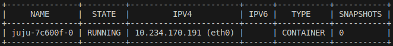
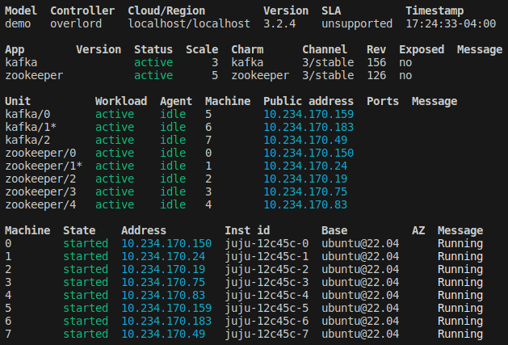
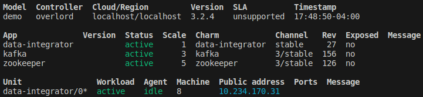
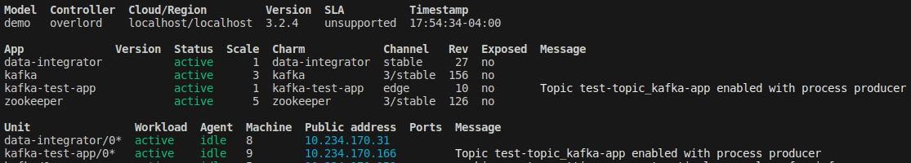
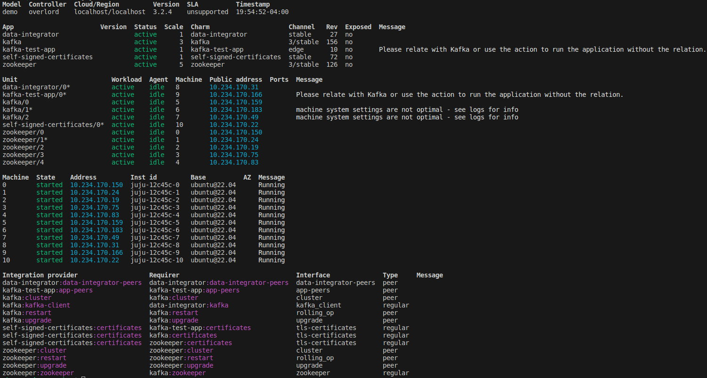

# Kafka on MicroStack

# Tutorials
* [install-microstack](https://microstack.run)
* [charmed-kafka](https://canonical.com/data/docs/kafka/iaas/t-overview)
* [zero-to-hero-kafka-connect](https://github.com/confluentinc/demo-scene/blob/master/kafka-connect-zero-to-hero/demo_zero-to-hero-with-kafka-connect.adoc)
* [debezium-kafka-connect](https://debezium.io/documentation/reference/stable/architecture.html)

## Bash Scripts
To run Kafka in single-broker mode, execute:
* ```. bash-scripts/run.sh```

## Remove microstack (clean environment)
```multipass stop microstack && multipass delete microstack && multipass purge && multipass list```

## Install microstack
The [run.sh](run.sh) script configures the following:
* On the host:
  * Install Multipass on the host which is a tool to manage VMs.
  * Create a Ubuntu 22.04 LTS VM named ```microstack```
    * I launched with the ```22.04``` option because sunbeam was not available for noble (default) at the time of writing this.
* Within ```microstack```:
  * Install OpenStack
  * Prepare a machine node (dependencies and configuration) using sunbeam
  * Install juju
  * Bootstrap OpenStack (initialize the OpenStack servicecs)
    * Terraform will create:
      * OpenStack Hypervisor
      * AMQP (Advanced Message Queuing Protocol) - Used by Nova, Glance, Cinder for exchanging messages asynchronously
      * Certifications
      * Identity - Authentication and authorization service - Keystone
      * OVN (Open Virtual Network) - Manage communication between virtual machines and other networked resources
    * There is an [fqdn-bug](https://bugs.launchpad.net/snap-openstack/+bug/2030349/comments/6) which is resolved with the [cloud-init.yaml](cloud-init.yaml) config file.
  * Configure OpenStack (generates an OpenStack RC file that contains env variables needed to interact with OpenStack services)
  * Launch a cloud instance (within OpenStack) named ```demo_instance```
    * This command launches a new Ubuntu cloud instance within the OpenStack environment
      * Any actions performed within this instance will be isolated within the OpenStack environment.
  * Bootstrap a Juju controller named overlord to LXD
  * Create a model (to host the Charmed Kafka app) named ```demo```
  * Create the zookeeper and kafka applications and relate them

### Notes:
* To enter the microstack VM run the following command from the host:
  * ```multipass shell microstack```
* Throughout the [run.sh](run.sh) execution, ```juju status --watch 1s``` commands are executed to check for the architecture status. Compare your status with the checkpoints provided in the results section below. Once yours matches you can exit by running ```Ctrl+C```.


### Result Checkpoints:

#### Bootstrap a juju controller named ```overlord``` to LXD



#### Juju deploy ```kafka``` and ```zookeeper```



#### Juju deploy ```data-integrator```



#### Consume produced messages to ```test-topic``` with ```kafka```


##### Log including the last 2 produced messages
```
==> /tmp/1714600296_producer.log <==
2024-05-01 21:52:08,743 INFO [__main__] (MainThread) (produce_message) Message published to topic=test-topic_kafka-app, message content: {"timestamp": 1714600328.740849, "_id": "5a2721a490f246af88ba5c340b31fc5a", "origin": "juju-12c45c-9 (10.234.170.166)", "content": "Message #48"}
2024-05-01 21:52:09,246 INFO [__main__] (MainThread) (produce_message) Message published to topic=test-topic_kafka-app, message content: {"timestamp": 1714600329.243787, "_id": "261074d346ef4a7daafd4c3bf8db8771", "origin": "juju-12c45c-9 (10.234.170.166)", "content": "Message #49"}
```
##### Log including the last 2 consumed messages
```
==> /tmp/1714601323_consumer.log <==
2024-05-01 22:08:51,001 INFO [__main__] (MainThread) (<module>) ConsumerRecord(topic='test-topic_kafka-app', partition=1, offset=11, timestamp=1714600326727, timestamp_type=0, key=None, value=b'{"timestamp": 1714600326.727628, "_id": "8a54a8f0fff3468bb9b1c85b6f06a869", "origin": "juju-12c45c-9 (10.234.170.166)", "content": "Message #44"}', headers=[], checksum=None, serialized_key_size=-1, serialized_value_size=145, serialized_header_size=-1)
2024-05-01 22:08:51,007 INFO [__main__] (MainThread) (<module>) ConsumerRecord(topic='test-topic_kafka-app', partition=1, offset=12, timestamp=1714600327734, timestamp_type=0, key=None, value=b'{"timestamp": 1714600327.734235, "_id": "f816951c2cc64ae9b959a9c4c6928d66", "origin": "juju-12c45c-9 (10.234.170.166)", "content": "Message #46"}', headers=[], checksum=None, serialized_key_size=-1, serialized_value_size=145, serialized_header_size=-1)
```

#### Juju deploy ```kafka-test-app```



#### Juju deploy ```self-signed-certificates``` with a final status and relations check of app architecture



```
==> /tmp/1714600296_producer.log <==
2024-05-01 21:52:08,743 INFO [__main__] (MainThread) (produce_message) Message published to topic=test-topic_kafka-app, message content: {"timestamp": 1714600328.740849, "_id": "5a2721a490f246af88ba5c340b31fc5a", "origin": "juju-12c45c-9 (10.234.170.166)", "content": "Message #48"}
2024-05-01 21:52:09,246 INFO [__main__] (MainThread) (produce_message) Message published to topic=test-topic_kafka-app, message content: {"timestamp": 1714600329.243787, "_id": "261074d346ef4a7daafd4c3bf8db8771", "origin": "juju-12c45c-9 (10.234.170.166)", "content": "Message #49"}
```

```
==> /tmp/1714601323_consumer.log <==
2024-05-01 22:08:51,001 INFO [__main__] (MainThread) (<module>) ConsumerRecord(topic='test-topic_kafka-app', partition=1, offset=11, timestamp=1714600326727, timestamp_type=0, key=None, value=b'{"timestamp": 1714600326.727628, "_id": "8a54a8f0fff3468bb9b1c85b6f06a869", "origin": "juju-12c45c-9 (10.234.170.166)", "content": "Message #44"}', headers=[], checksum=None, serialized_key_size=-1, serialized_value_size=145, serialized_header_size=-1)
2024-05-01 22:08:51,007 INFO [__main__] (MainThread) (<module>) ConsumerRecord(topic='test-topic_kafka-app', partition=1, offset=12, timestamp=1714600327734, timestamp_type=0, key=None, value=b'{"timestamp": 1714600327.734235, "_id": "f816951c2cc64ae9b959a9c4c6928d66", "origin": "juju-12c45c-9 (10.234.170.166)", "content": "Message #46"}', headers=[], checksum=None, serialized_key_size=-1, serialized_value_size=145, serialized_header_size=-1)
```
